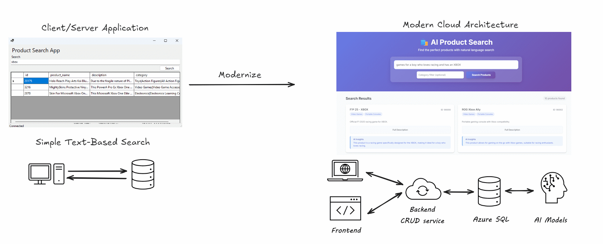

# Migrate and Modernize with Azure SQL

> [!NOTE]
> If you want to explore the new SQL Server 2025, you can use the [`sql-server-2025`](https://github.com/Azure-Samples/azure-sql-modernize-app-with-ai/tree/sql-server-2025) branch of this repository.

This repository contains a sample application and scripts to demonstrate how to modernize your applications *after you have migrated your database to Azure*, using Azure SQL and AI, without the need to change your application code and taking advantage of [Data API builder](https://aka.ms/dab) to create a modern data access layer.

- [Migrate to Azure](#migrate-to-azure)
- [Modernize your applications with Azure SQL and AI](#modernize-your-applications-with-azure-sql-and-ai)
- [Bring AI to your data](#bring-ai-to-your-data)

You can also see a recoding of this sample here: [Migrate and modernize Windows Server, SQL Server, and .NET workloads](https://www.youtube.com/watch?v=H_2OgOL3fpo&t=982s)



## Migrate to Azure

To migrate your database to Azure you can use one of the recommended tool and processes: [Compare SQL data migration tools](https://learn.microsoft.com/en-us/sql/sql-server/migrate/dma-azure-migrate-compare-migration-tools?view=sql-server-ver16). For a more generic overview of how to migrate an entire solution to Azure you can start from here: [Azure Migrate Overview](https://learn.microsoft.com/en-us/azure/migrate/migrate-services-overview)

## Modernize your applications with Azure SQL and AI

A sample Windows application is provided in the DemoApp folder. Create a `.env` file from the provided sample, setting the connection string to you Azure SQL database.

You can run the application and search for products using the search box. You'll see that just by updating the stored procedure, as explained in the next steps, you can improve the search experience without having to change the application code.

```
cd DemoApp
dotnet run
```

## Bring AI to your data

### Download and import the public Walmart US Product dataset, enriched with Vector Embeddings

Download the [Walmart Dataset](https://www.kaggle.com/datasets/mauridb/product-data-from-walmart-usa-with-embeddings), unzip it and upload it (using [Azure Storage Explorer](https://learn.microsoft.com/azure/vs-azure-tools-storage-manage-with-storage-explorer?tabs=windows) for example) to an Azure Blob Storage container.

In the example the unzipped csv file `walmart-product-with-embeddings-dataset-usa.csv` is assumed to be uploaded to a blob container name `playground` and in a folder named `walmart`.

### Create OpenAI models

Make sure you have an [Azure OpenAI](https://learn.microsoft.com/en-us/azure/ai-services/openai/overview) resource created in your Azure subscription. Withi the OpenAI resource create two models:

- `embeddings`, using the `text-embedding-ada-002` model
- `gpt-4o`, using the `gpt-4o` model (minimum version required: 2024-08-06 as [structured output is needed](https://learn.microsoft.com/en-us/azure/ai-services/openai/how-to/structured-outputs?tabs=python-secure%2Cdotnet-entra-id&pivots=programming-language-python#supported-models))

Then get the OpenAI URL Endpoint and API Key as they will be needed in the next step.

### Create and load database table and related database objects

Use the `./sql/000-setup-table.sql` to create the `ecommerce_product_details` table and load it with the Walmart dataset downloaded above, the use the `./sql/001-search-simple.sql` to create a basic stored procedure to search in the product detail table.

### Test the loaded data

To test the loaded data, run the following queries:

```sql
select count(*) from dbo.ecommerce_product_details
```

It should return `30000` rows, then run

```sql
select top(10) id, product_name, [description], brand, category from dbo.ecommerce_product_details order by id
```

to see the first 10 rows of the dataset.

### Create a simple, non-AI, stored procedure for searching products

Use the `./sql/001-search-simple.sql` to create a basic stored procedure to search in the product detail table. The procedure use a simple, classic, `LIKE` search which has very limited capabilities and could be modernized with AI. 

For example you can search all the products in the "Video Games" category that contains the word "xbox" in the product name by running:

```sql
exec dbo.search_products 'xbox', 'Video Games'
```

### Modernize the search procedure using vectors and semantic search

The scripts  `./sql/002-get-embedding` and `./sql/003-search-vector.sql` update the previous stored procedure to use [embeddings](https://learn.microsoft.com/en-us/azure/azure-sql/database/ai-artificial-intelligence-intelligent-applications?view=azuresql#embeddings) to search for similar products based on the provide search text. The procedure uses the `text-embedding-ada-002` model to generate embeddings for the search term and the product names in the database, then uses the cosine similarity to find the most similar products.

Thanks to embeddings, the search is now more powerful and can find products that are similar to the search term, even if the search term is not exactly in the product name.

```sql
exec dbo.search_products 'games for teenage boy passionate about xbox', 'Video Games'
```

### Modernize the search procedure even more using GPT-4o

The script `./sql/004-search-gpt.sql` updates the previous stored procedure to use GPT-4o to better understand the provided search query so that the retrieved products are more relevant to the user's intent. Also, explanation of why retrieved products are relevant is provided.

```sql
exec dbo.search_products 'help me find games for teenage boy passionate about xbox video games', 'Video Games'
```

## Modernize your application architecture with Data API Builder

Now that you have brought AI capabilities to your database, you can now start modernizing your application architecture with [Data API Builder](https://aka.ms/dab). For example you may want to privide a REST or GraphQL endpoints to developers to access the search capabilities you just created. And maybe you want to build a full-stack application using modern front-end frameworks like React or Angular.

Look no further than the `DAB` folder with you all you have to do is download the [Data API Builder](https://aka.ms/dab) and run the `dab` command to take the created stored procedure and make it available as REST and GraphQL API.

First of all install Data API Builder:

```bash
dotnet tool install microsoft.dataapibuilder --global
```

Create a `.env` file from the provided sample, setting the connection string to you Azure SQL database. Then run the following command to run Data API Builder:

```bash
cd DAB
dab start
```

Once you'll see the message `Now listening on: http://localhost:5000` you can open your browser and navigate to `http://localhost:5000/swagger` to see the generated API documentation.

Thanks to Data API builder, the only needed to connect your front-end application to the database is to use the generated API endpoints, without the need to write any additional code. For example, to call the GraphQL endpoint to search for products you can use the following code:

```javascript
var graphql = `
    query {
        executeSearchProducts(searchTerm: "${searchTerm}") {                        
            id                        
            product_name
            short_description     
            thoughts                 
        }  
    }
`;
var url = "http://localhost:5000/graphql";
var response = await fetch(
    url, {
    method: "POST",
    headers: {
        "Content-Type": "application/json",
    },
    body: JSON.stringify({ "query": graphql })
})
var payload = await response.json();
```

## AI-Powered Web Application Interface

The `WebApp` folder contains a modern, responsive web application that provides an intuitive interface for searching products using natural language queries. This application demonstrates how to build a complete front-end solution that leverages the AI-powered Azure SQL backend through Data API Builder.

### Web Application Features

- 🎯 **Natural Language Search**: Search for products using conversational queries like "find the best video game to gift to a teenager boy"
- 🎨 **Modern UI**: Clean, responsive design with Fluent UI components and Tailwind CSS styling
- 🔍 **Category Filtering**: Optional category-based filtering for more targeted searches
- 🧠 **AI Insights**: Display AI-generated thoughts and recommendations for each product
- ⚡ **Real-time Search**: Debounced search as you type for instant results
- 📱 **Responsive Design**: Works seamlessly on desktop, tablet, and mobile devices
- 🎭 **Smooth Animations**: Fade-in effects and smooth transitions for better UX

### Technologies Used in Web App

- **HTML5**: Semantic markup with modern web standards
- **JavaScript (ES6+)**: Modern JavaScript with async/await and fetch API
- **jQuery**: DOM manipulation and event handling
- **Tailwind CSS**: Utility-first CSS framework for styling
- **Fluent UI Web Components**: Microsoft's design system components
- **Data API Builder**: RESTful API for Azure SQL database access

### Running the Web Application

To run the web application, ensure the Data API Builder is running first:

```bash
cd DAB
dab start
```

Then open another terminal windows and serve the web application:

```bash
cd WebApp
# Using Node.js http-server
npx http-server

# Or using Python
python -m http.server 8000

# Or use Live Server in VS Code
# Right-click on index.html and select "Open with Live Server"
```

Navigate to `http://localhost:8080` (or the port shown in your terminal) to access the application.

### Example Search Queries

Try these natural language queries in the web application:

- "find the best video game to gift to a teenager boy"
- "educational toys for kids"
- "outdoor sports equipment"
- "electronics for home office"
- "books for learning programming"

### API Integration

The web application connects to the Data API Builder endpoint at `http://localhost:5000/api/searchProducts` using RESTful calls, providing a seamless integration between the modern front-end and the AI-powered Azure SQL backend.

> **Note**: All content in the WebApp folder has been generated by GitHub Copilot with Claude Sonnet 4, based on the requirements of the Azure SQL Modernize App with AI sample, showcasing how AI can assist in creating modern web applications. A sample of the saved prompts, along with LLM answers, used to generate the code is provided in the `./WepApp-Prompt.txt` file.
